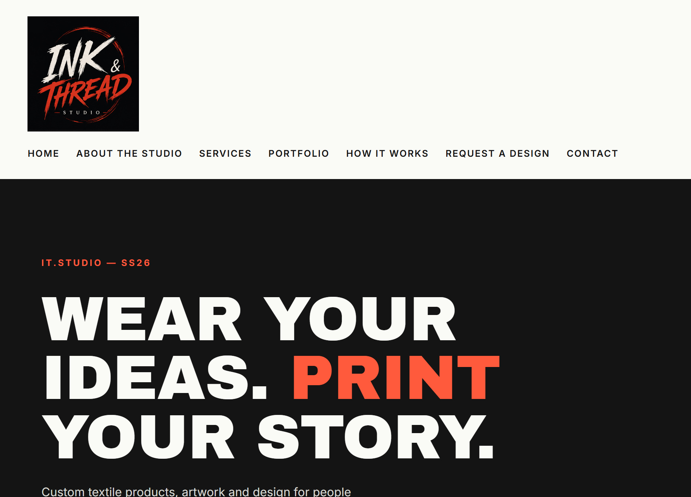
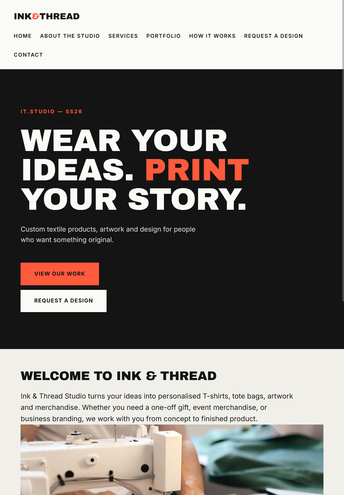
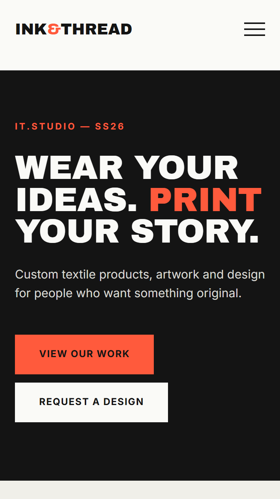
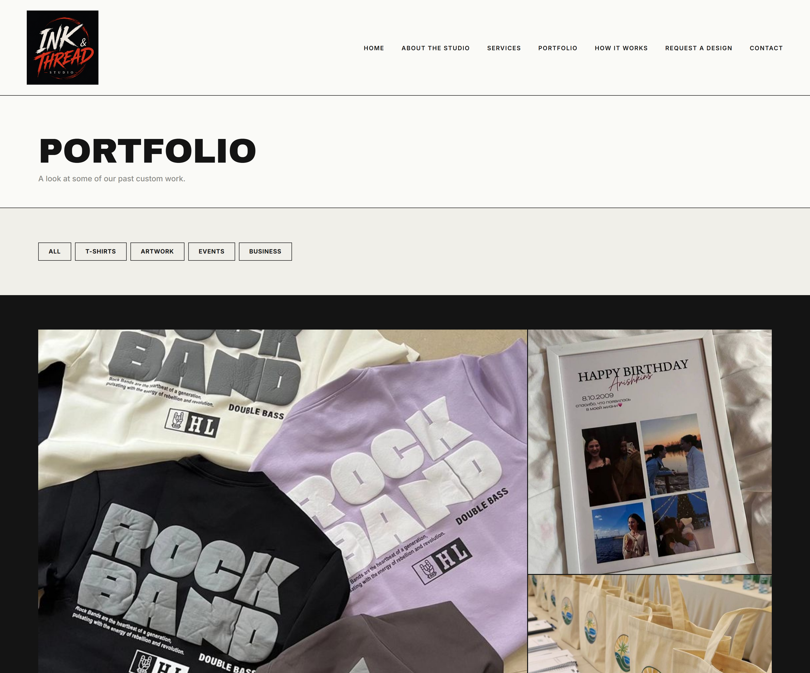
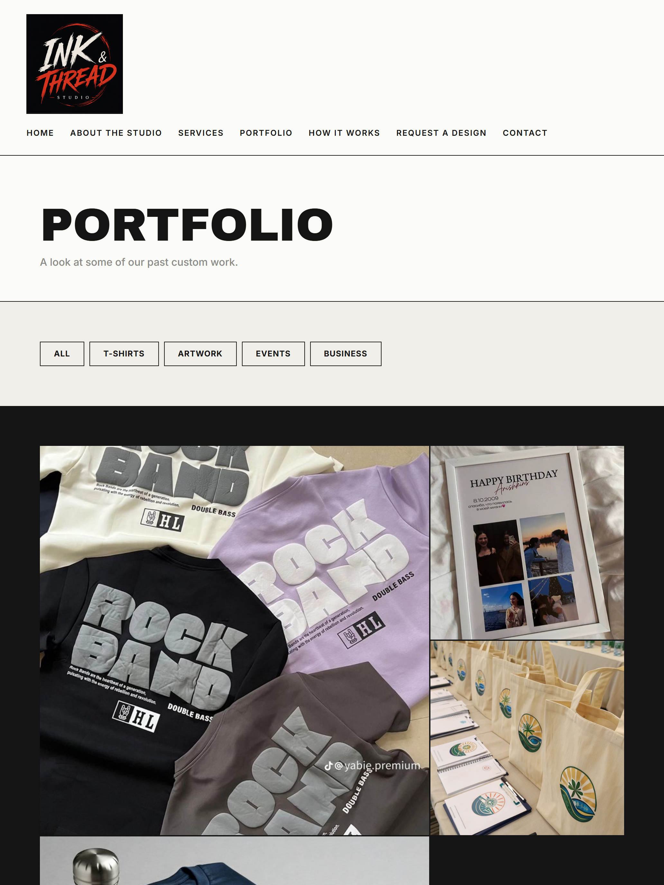
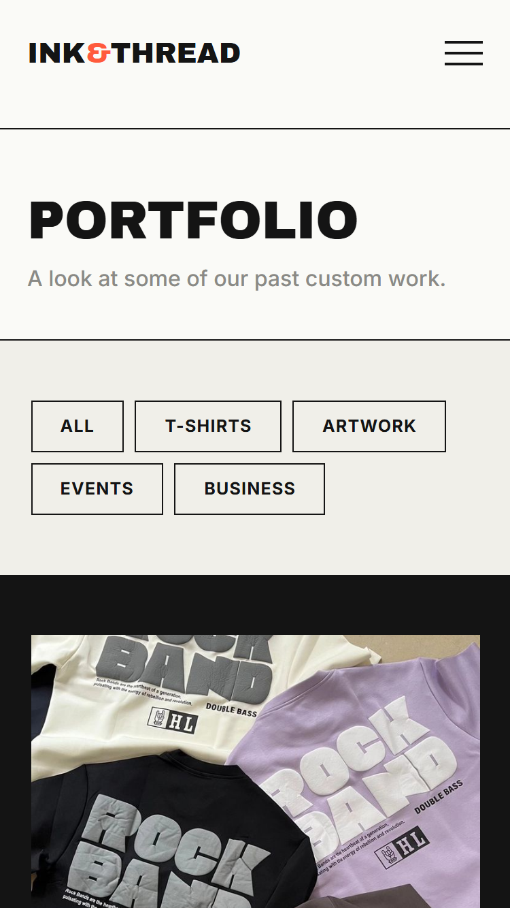
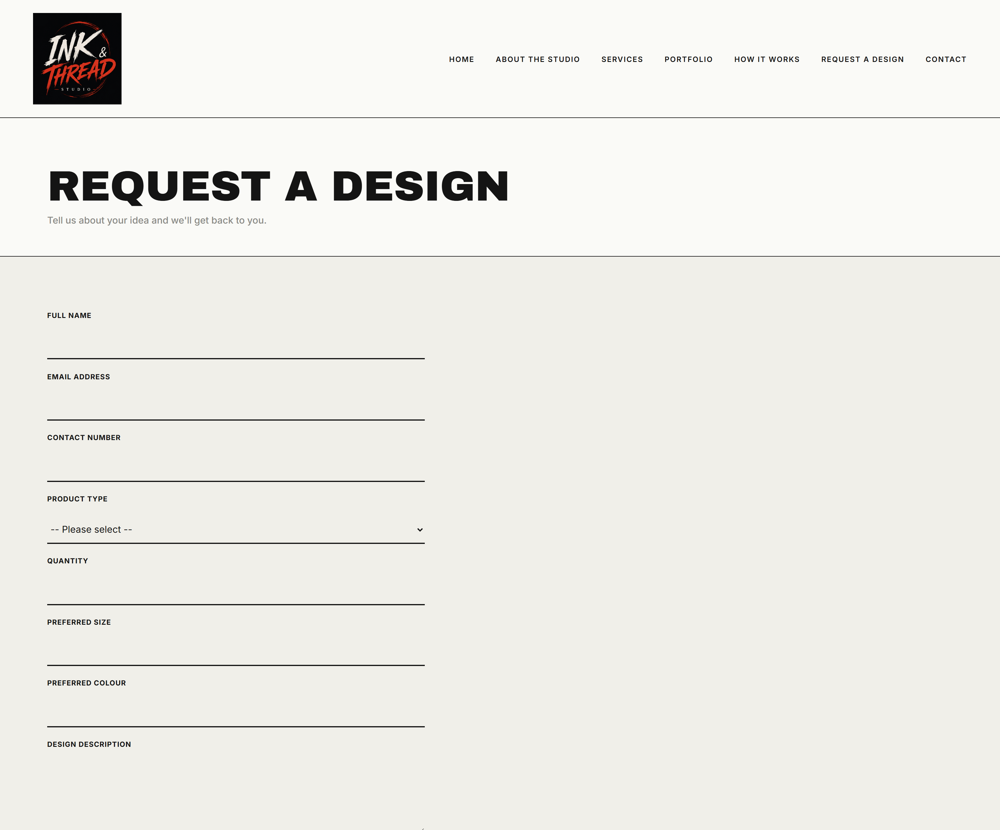
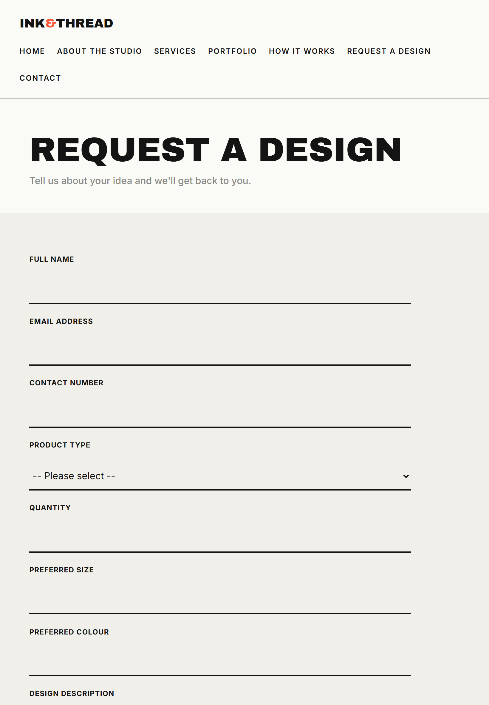
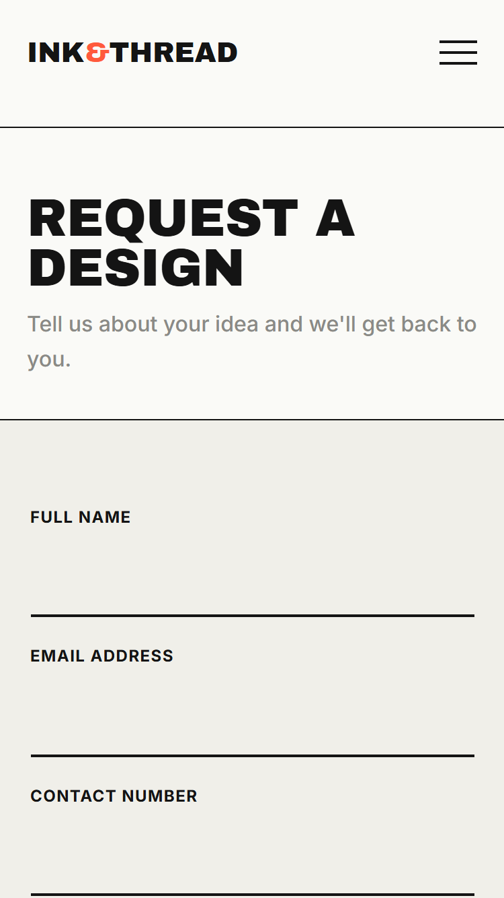

# Ink & Thread Studio — Website Project

**Module:** WEDE5020 (Web Development) — Part 2: Designing the Visuals (CSS
Styling and Responsive Design)
**Student Project:** Ink & Thread Studio, a fictional creative studio offering
custom textile products, artwork and graphic design.
**Student Number:** ST10523391

## Project Overview

Ink & Thread Studio currently has no website — it operates only through social
media, which makes it hard for customers to browse past work, understand
pricing/process, or submit a custom order in a structured way. This project
builds a multi-page website that gives the studio a professional online
presence, showcases its portfolio, and lets customers submit custom design
requests directly instead of relying on informal DMs.

**Goal:** Create a functional, visually distinctive website that reflects the
studio's creative identity and makes it easy for customers to browse work and
request a custom design.

**Objectives:**
- Create seven linked HTML pages covering Home, About, Services, Portfolio,
  How It Works, Request a Design, and Contact.
- Provide a working, consistent navigation menu across every page.
- Present the studio's services and past work with real descriptive content
  and supporting images.
- Provide a detailed custom design request form that captures everything
  needed to quote and produce an order.
- Apply a consistent, distinctive visual identity across all pages.

**Target audience:** Students, young adults, individuals and small businesses
looking for personalised textile products, artwork and graphic design.

## Pages / Features

| Page | Purpose |
|---|---|
| `index.html` (Home) | Introduces the studio, its tagline, and links to Portfolio and Request a Design |
| `about.html` | Studio background, creative philosophy, mission and vision |
| `services.html` | Full list of services offered, each with description and image |
| `portfolio.html` | Gallery of past work, filterable by category (filtering logic added in Part 3) |
| `how-it-works.html` | The four-step custom order process |
| `request-design.html` | Detailed custom design request form |
| `contact.html` | Contact details, social links, and a general enquiry form |

## Technologies Used

| Requirement | Tool |
|---|---|
| Code editor | Visual Studio Code |
| Browser | Google Chrome / Microsoft Edge |
| Markup | HTML5 (semantic elements: `header`, `nav`, `main`, `section`, `article`, `footer`) |
| Styling | CSS3 — external stylesheet (`css/style.css`) using Flexbox, CSS Grid, custom properties, and media queries for responsive design |
| Version control | Git + GitHub |
| Fonts | Google Fonts (Archivo Black, Inter) |
| Images | To be legally sourced / self-produced (see Content Research below) |

## How to Open / Run the Website

1. Download or clone the repository.
2. Open the `ink-thread-website` folder in Visual Studio Code (or any editor).
3. Open `index.html` directly in a browser (double-click the file, or use the
   VS Code "Live Server" extension for auto-reload).
4. Navigate the site using the menu — every page links to every other page.

No server, database or build step is required for Part 1.

## Project Structure

```
ink-thread-website/
├── index.html
├── about.html
├── services.html
├── portfolio.html
├── how-it-works.html
├── request-design.html
├── contact.html
├── css/
│   └── style.css
├── js/
│   └── script.js
├── images/
│   ├── logo.png
│   ├── custom-made-tshirt.jpg
│   ├── personalised-artwork-print.jpg
│   ├── event-business-merch.jpg
│   └── branded-business-merch.jpg
└── README.md
```

*Note: images currently sit in a single flat `images/` folder rather than the
subfolders originally planned in Part 1. This was simplified once the actual
number of images was confirmed; see Content Research & Sourcing below for
outstanding images.*

## Sitemap

```
Home
├── About the Studio        – studio story, philosophy, mission & vision
├── Services                 – full list of services offered
│   ├── Custom T-Shirts
│   ├── Tote Bags
│   ├── Personalised Artwork
│   ├── Event Merchandise
│   └── Business Merchandise
├── Portfolio                – filterable gallery of past work
├── How It Works              – 4-step custom order process
├── Request a Design          – custom order form
└── Contact                   – contact details, socials, general enquiry form
```

All seven pages sit at the same level, one click from Home, matching the flat
navigation menu used throughout the site.

## Content Research & Sourcing

Content inventory — what each page needs, and current sourcing status:

| Page | Text content | Images/assets needed | Source / status |
|---|---|---|---|
| Home | Welcome message, tagline, service summary | Studio workbench hero image (`images/general/studio-workbench.jpg`) | Original copy written; image referenced in code but **still not sourced — currently broken, outstanding for Part 3** |
| About | Studio story, philosophy, mission, vision | Studio workspace image (`images/studio/studio-space.jpg`) | Original copy written; image referenced in code but **still not sourced — currently broken, outstanding for Part 3** |
| Services | Description per service (6) | One image per service | Original copy written; images **still to be sourced** (own work samples or licensed stock) |
| Portfolio | Category labels, item titles | 4+ portfolio photos across categories | **Sourced and in use** — 4 images in `images/` covering T-Shirts, Artwork, Events and Business categories |
| How It Works | 4-step process description | None required | Original copy written |
| Request a Design | Form field labels only | None required | N/A |
| Contact | Contact details, social handles | None required | Placeholder contact details (fictional business) |

**Outstanding for Part 3:** the Home and About hero images are still missing
files, so those two `` tags currently render as broken images. This is
tracked here rather than silently fixed, so it is not lost before final
submission.

**Sourcing plan:** All text content is original, written specifically for this
project. Images will be sourced either from the student's own photography /
design work, or from royalty-free libraries (e.g. Unsplash, Pexels) with
source and licence recorded here once selected. No copyrighted or watermarked
third-party images will be used without a licence.

## Design Direction

Theme: **"Modern Fabric Grid"** — an editorial, fashion-magazine-inspired
layout that treats the portfolio like a grid of fabric swatches, paired with
bold, confident typography to reflect the studio's creative, design-forward
identity.

- **Typography:** Archivo Black (display) + Inter (body)
- **Colour palette:** near-black, off-white, electric coral accent, muted teal
- **Signature element:** asymmetric portfolio grid with hairline borders and
  hover reveal, echoing how fabric swatches are laid out for selection

## Responsive Design Testing

Breakpoints used:

| Breakpoint | Width | Behaviour |
|---|---|---|
| Desktop | > 900px | Full multi-column layout, horizontal nav |
| Tablet | 780px – 900px | Portfolio grid reflows to 2 columns; layout otherwise unchanged |
| Mobile | < 780px | Navigation collapses behind a hamburger toggle; sections stack to a single column |

Tested using Chrome/Edge DevTools device toolbar (Ctrl+Shift+M) at common
device presets (e.g. iPhone SE, iPad Air, and a standard 1440px desktop
viewport).

**Screenshots (desktop / tablet / mobile):** *to be added here* — for each of
`index.html`, `portfolio.html` and `request-design.html`, add three
screenshots (desktop, tablet, mobile) below, e.g.:

markdown
### index.html




### portfolio.html




### request-design.html




Save the images in a `screenshots/` folder in the repo root and reference them
the same way for the other pages before final submission.

## Changelog

### Version 2.1 — Aligned with CSS Fundamentals Part 2 lecture guideline
- **Fixed a specificity anti-pattern:** `.service-item` used `!important` to
  force its padding over `main > section`. Checked the actual specificity
  (`.service-item` = 0,1,0 vs `main > section` = 0,0,2 — the class already
  wins) and removed the unnecessary `!important`, per the lecture's guidance
  to "keep selectors simple; do not solve every conflict with `!important`."
- **Added box-shadow + hover-lift polish** to the How It Works process-step
  cards (`transition: transform`, `box-shadow` on hover), matching the
  "small polish, big difference" pattern from the lecture — these cards
  previously had no depth or hover feedback at all.
- Confirmed existing use of the lecture's core techniques against the slide
  deck: `position: sticky` on the header, `position: relative`/`absolute`
  for the portfolio caption overlay and mobile nav icon, a shared
  `input, select, textarea` rule for consistent form styling, visible
  `:focus-visible` states throughout, and `auto-fit`/`minmax()` Grid for
  responsive card layouts without hard-coded widths.

### Version 2.0 — Part 2: CSS Styling and Responsive Design
- Added external stylesheet `css/style.css`, linked from all seven pages.
- Established base styles: CSS custom properties for the colour palette,
  a CSS reset, base typography (Archivo Black for headings, Inter for body
  text), and consistent spacing.
- Applied Flexbox and CSS Grid layouts across all pages, including the
  asymmetric "fabric swatch" portfolio grid and the featured-services /
  process-steps card grids.
- Styled all visual states: hover, focus-visible and active states for
  navigation links, buttons, portfolio items and form fields.
- **Fixed:** `.header-inner` (the wrapper around the logo, nav toggle and
  navigation menu) had no CSS rules, so the intended flex layout was
  incorrectly applied to `<header>` instead, which has only one child. Moved
  the flex layout onto `.header-inner` so the header lays out correctly.
- **Fixed:** the mobile navigation checkbox/label ("hamburger") markup
  existed in the HTML on every page but had no matching CSS, so the menu
  never collapsed on small screens. Added full hamburger icon styling and
  a checkbox-driven show/hide animation for the mobile nav.
- **Fixed:** `index.html` had a broken, unclosed logo link (`` tag with
  no closing `</a>`), inconsistent with the text logo used on every other
  page. Standardised the logo markup across all pages.
- Implemented responsive design with breakpoints at 900px (tablet — portfolio
  grid reflow) and 780px/640px (mobile — hamburger nav, single-column
  sections), using relative units (`rem`, `%`, `clamp()`) throughout.
- Added extra code comments to the Request a Design form to group related
  fields (contact details, order details, creative brief) and clarify the
  placeholder form action ahead of Part 3.
- Removed `changelog.html`. It duplicated this section and the brief requires
  the changelog to live in the README, not as a separate page.

### Part 1 feedback corrections (from Part 1 marking: 84/100)
- **Comments:** Added further explanatory comments to the Request a Design
  form and to the new CSS rules, addressing feedback that comments did not
  fully explain the code.
- **Changelog:** Consolidated the previously separate, minimal `changelog.html`
  into this properly detailed README changelog, addressing feedback that the
  changelog needed more detail.
- **References:** Corrected reference formatting and typos (see below),
  addressing feedback that references needed improvement.
- **Content Research and Sourcing:** Updated the sourcing table to accurately
  reflect which images are in use versus still outstanding, rather than
  leaving it in its original Part 1 state.
- Note: feedback on Goals/Objectives, Current Analysis, Proposed Features,
  Design Aesthetic, Technical Requirements, Timeline and Budget applies to
  the separate project proposal document (not this README/codebase).
  Proposal 2 was approved and is the version reflected in this build.

### Version 1.2
- Added page title metadata.

### Version 1.0
- Added all seven pages: Home, About, Services, Portfolio, How It Works,
  Request a Design, and Contact.

## References

OpenAI (2025) *ChatGPT* (version 5.3) [Large language model]. Available at: https://chat.openai.com/ (Accessed: 12 April 2026).

Mozilla Developer Network (2026) *CSS Grid Layout*. Available at: https://developer.mozilla.org/en-US/docs/Web/CSS/CSS_grid_layout (Accessed: 8 August 2026).

Mozilla Developer Network (2026) *Flexible Box Layout*. Available at: https://developer.mozilla.org/en-US/docs/Web/CSS/CSS_flexible_box_layout (Accessed: 8 August 2026).

W3Schools (2026) *HTML Forms*. Available at: https://www.w3schools.com/html/html_forms.asp (Accessed: 8 August 2026).

Anthropic (2026) *Claude (Sonnet)* [Large language model]. Available at: https://claude.ai (Accessed: 8 August 2026).

Pinterest (2026) *Modern fabric grid website design inspiration*. Available at: https://www.pinterest.com (Accessed: 16 August 2026).

Unsplash. (n.d.). Unsplash: The internet’s source for visuals. Available at: https://unsplash.com (Accessed 18 September 2026).